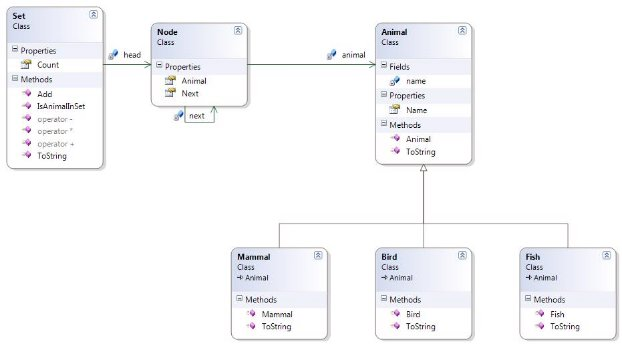
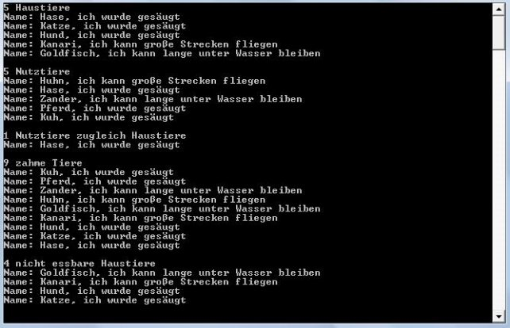

# POSE 5ABIF/5ACIF

## Zoo

Lehrziele

- Einführung in die Vererbung 
- Verketten von Konstruktoren
- Überladung von Operatoren (Menge)
- Dynamisch verkettete Liste

### Aufgabenstellung

Zur Einführung in die Vererbung modellieren wir Tiere verschiedener Gattungen (Bird, Fish, Mammal = Säugetier). Gemeinsam haben sie, dass sie ihren Namen verwalten können. Jede Gattung gibt einen speziellen Text aus. Überschreiben Sie dazu die Methode `ToString()`. In der Klasse `Animal`, von der die einzelnen Gattungen abgeleitet sind, wird die Methode `ToString()` überschrieben und gibt den entsprechenden Namen aus.

**Hinweis:** Obwohl die Klasse `Animal` **scheinbar** von keiner Klasse erbt, muß die Methode `ToString()` dort auch bereits mit `override` gekennzeichnet werden. Wissen Sie warum?

Die Tiere werden in einer Klasse (Mengen - Set) verwaltet. Ein Tier ist enthalten oder nicht, mehrfaches Vorkommen ist nicht möglich. Auch die Menge ist in der Lage, sich selbst über `ToString()` als Text zurück zu geben: Für alle in der Menge enthalten Tiere wird `ToString()` aufgerufen und zu einem Gesamtstring zusammengefasst. Zeilenumbrüche nicht vergessen!

Die Klasse `Set` ist als Liste zu verwalten und ist entweder leer (head == null) oder enthält Tiere unterschiedlichster Gattung.

Es sind folgende Operatoren zu überladen:

- Vereinigungsmenge (Operator +)
  - Enthält alle Elemente, die zumindest in einer Menge enthalten sind
- Durchschnittsmenge (Operator \*)
  - Enthält alle Elemente die in beiden Mengen enthalten sind
- Differenzmenge (Operator -)

•  Enthält alle Elemente die in der ersten Menge enthalten sind und in der zweiten nicht Klassendiagramm:



Diesmal gibt es keine Unittest-Vorlage. Testen Sie ihre Anwendung mit Hilfe des beiliegenden Hauptprogramms und mit selbst erstellten Unittests. 

### Hinweise zur Benennung der Tests

Die Tests sind nach dem Schema ``` ItShould[ExpectedResult]_Given[Condition]() ``` benannt worden. Dieses Schema ist sehr nützlich, um Testmethoden verständlicher und aussagekräftiger zu gestalten.

Überblick der Benennungsstruktur:

- **ItShould[ExpectedResult]:** Beschreibt, was als Ergebnis erwartet wird, z.B. "ReturnZeroCount", "IncreaseCount", "ThrowOutOfRangeException".
- **Given[Condition]:** Gibt die Bedingung an, unter der der Test durchgeführt wird, z.B. "AnEmptyList", "AnItemIsAdded", "AnItemIsRemoved".

Die Ausgabe des beiliegenden Hauptprogramms:



**Spezialistenaufgabe (Spezialisierung)**: 

- Implementieren Sie die Klasse `Set` als generische Klasse. 
- Erweitern Sie die Aufgabe so, dass sie in der Klasse `Bird` ein Feld `cantFly` ergänzen. Dieses Feld soll, zusätzlich zum Namen, mittels eines überladenen Konstruktors gesetzt werden können:

`Bird penguin = new Bird("Pinguin", false);`

Geben Sie bei der `ToString()`-Methode des Vogels dann einen passenden Text, auch für flugunfähige Vögel, aus. Standardmäßig (d.h. wenn der Konstruktor mit nur einem Parameter aufgerufen wird) sollen die Vögel fliegen können.

Zum Testen setzen Sie die auskommentierten Zeilen am Ende des Hauptprogramms wieder aktiv.


